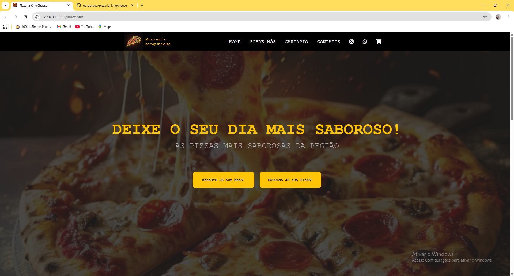
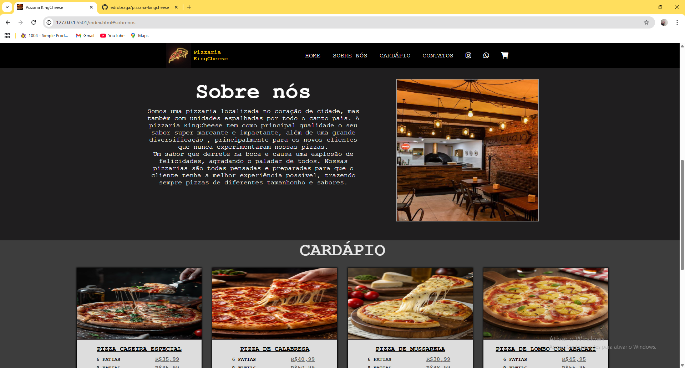
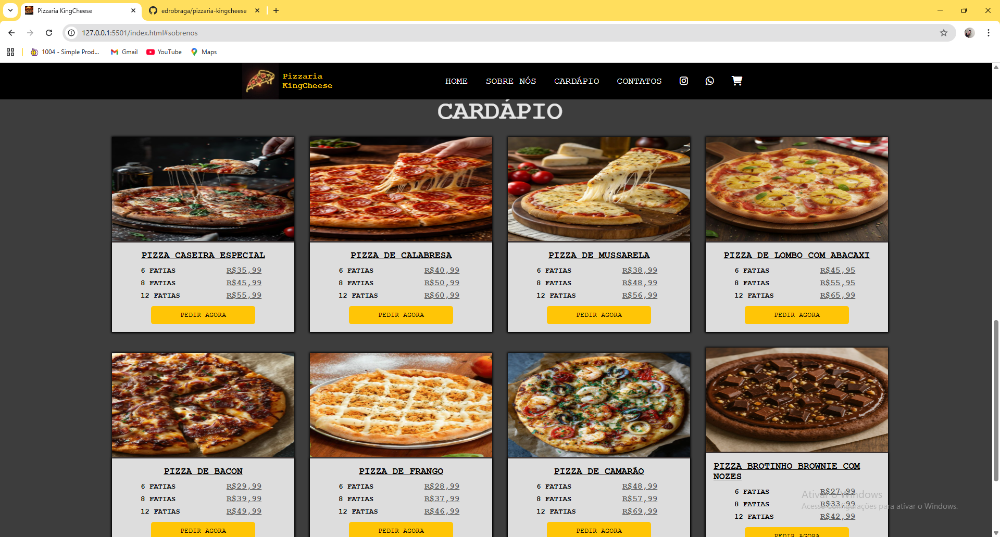
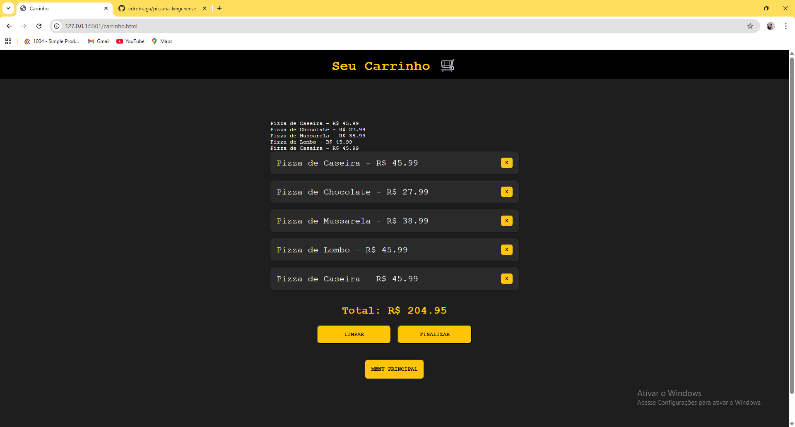

# 🍕 Pizzaria KingCheese

Este projeto consiste no desenvolvimento de um site completo de uma pizzaria, com foco em simular uma experiência real de pedido online.

A aplicação permite que o usuário navegue pelo cardápio, adicione produtos ao carrinho e finalize o pedido diretamente pelo WhatsApp, proporcionando uma experiência prática e intuitiva.


---

## 🚀 Funcionalidades

- 🛒 Sistema de carrinho de compras dinâmico
- ➕ Adição de produtos ao carrinho
- ❌ Remoção individual de itens
- 🧹 Limpeza completa do carrinho
- 💾 Persistência de dados com localStorage
- 🔄 Atualização dinâmica dos itens e total
- 📲 Integração com WhatsApp para envio automático do pedido
- 📱 Design responsivo para diferentes dispositivos
- 🍕 Interface moderna inspirada em aplicações reais de delivery

---

## 🧠 Lógica implementada

O projeto utiliza JavaScript puro para manipulação de dados e interface, incluindo:

- Manipulação do DOM
- Eventos de clique
- Armazenamento e recuperação de dados com localStorage
- Estruturação de objetos para representar produtos
- Geração dinâmica de elementos HTML
- Cálculo automático do valor total do carrinho

---

## 💡 Diferenciais do projeto

- Simulação de fluxo real de compra online
- Integração direta com WhatsApp (geração automática da mensagem)
- Separação entre página principal e página de carrinho
- Estrutura organizada e escalável
- Código limpo e reutilizável

---

## 🖥️ Tecnologias utilizadas

- HTML5
- CSS3
- JavaScript (Vanilla JS)

---

## 📸 Preview do projeto






## 📦 Como rodar o projeto

```bash
# Clone o repositório
git clone https://github.com/edrobraga/pizzaria-kingcheese.git

# Acesse a pasta
cd pizzaria-kingcheese

# Abra o index.html no navegador

Pedro Braga
📍 Rio de Janeiro
🔗 https://www.linkedin.com/in/pedro-braga-108b77249/
